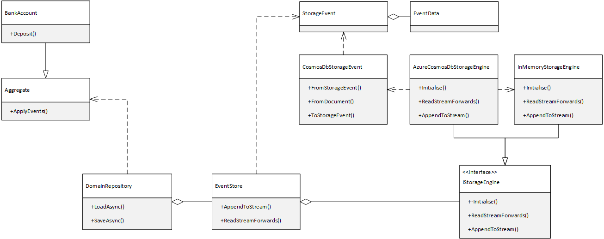

# Event Sourcing Tutorial


## Simple Event Store
Simple Event Store is an Event Sourcing framework that is available in [GitHub](https://github.com/ASOS/SimpleEventStore).
### Class diagram


Aggregates inherit from the *Aggregate* class.

The *DomainRepository* class allows you to load an save aggregates from an *EventStore*. 

The EventStore is associated with a *StorageEngine*, allowing you to choose from CosmosDB, InMemory, or any other data store that you prefer.

## Design-time
The business aggregate inherits from the Aggregate abstract class.
Methods are added which execute operations against the aggregate. The operation applies an event.
Further protected methods are added which are called when events are applied. They mutate the state of the aggregate.
```
public class BankAccount : Aggregate
{
    public decimal Amount { get; private set; }

    public BankAccount(string id) : base (id)
    {
    }

    public void Deposit(decimal amount)
    {
        this.Apply(new MoneyDeposited(amount));
    }

    protected void UpdateState(MoneyDeposited deposited)
    {
        this.Amount = deposited.Amount;
    }
}
```
## Initialisation
An EventStore is created, with a reference to an underlying storage engine.

The EventStore is then passed into the constructor of a new DomainRepository.
```
var eventStore = new EventStore(new InMemoryStorageEngine());
var repository = new DomainRepository(eventStore);
```
## Operation
The aggregate is instantiated. The DomainRepository loads the events from storage and applies them to the aggregate.

Commands are performed against the aggregate and then finally the repository saves the event stream back to storage. A StreamConcurrencyException is thrown if another process attempts to update the aggregate during the same time and no conflict resolution is in place.
```
var account = new BankAccount(id);
await repository.LoadAsync(account);
account.Deposit(10);
await repository.SaveAsync(account);
```

## Conflict Resolution
When an aggregate is loaded the event stream is held in memory and any new updates are appended to the end of the stream. If two instances of the same aggregate (having the same identity) are modified in parallel then when the second instance is saved a StreamConcurrencyException is thrown. If the business process is likely to perform a lot of parallel operations on the same stream then these concurrency errors can degrade performance.

[This article](https://www.michielrook.nl/2016/09/concurrent-commands-event-sourcing/#:~:text=Conflict%20resolution) describes conflict resolution. It is possible and may be desirable to enhance the SimpleEventStore framework to support conflict resolution. This would allow certain, whitelisted, events to be written concurrently. When the writer detects that the stream has been updated and the stream version number has been modified, it reloads the stream and then reattempts to append to it.

